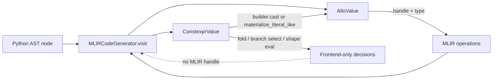
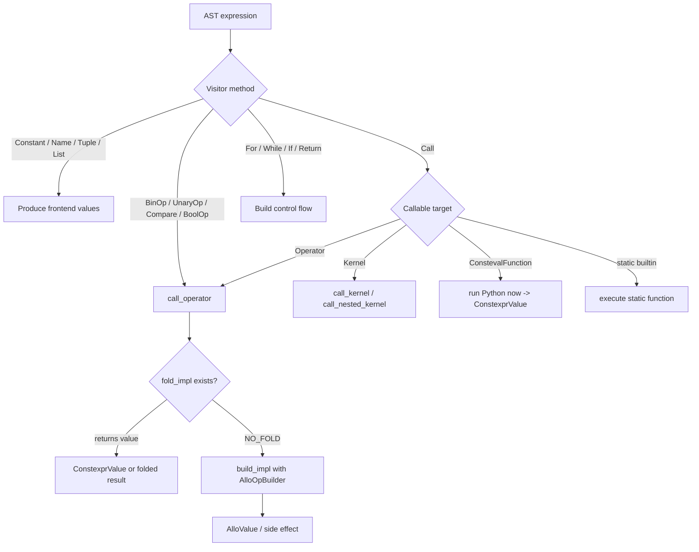
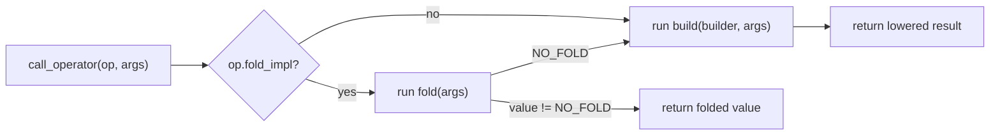

%toc%
# Compiler Infrastructure

This document explains the new frontend code generation stack for developers.
The implementation currently lives under `allo/exp`, with three main layers:

- `allo/exp/compiler/mlir_codegen.py`: AST traversal, scopes, dispatch, and
  high-level lowering control.
- `allo/exp/compiler/builder.py`: typed MLIR construction helpers and
  user-facing diagnostics.
- `allo/exp/operators/`: reusable operation definitions implemented with
  `operator.fold` and `operator.build`.

The most important design rule is that frontend lowering keeps compile-time
values and runtime SSA values distinct: `ConstexprValue` and `AlloValue`.
`AlloSymbolRef` still exists in the implementation as an internal symbol proxy
from earlier global-stream experiments, but `GStream` is not part of the current
public frontend surface. New user-visible stream work should use local
`StreamType` values represented by `AlloValue`.

## Value Model

The frontend value system is defined in `allo/exp/lang/core.py`.

`ConstexprValue` is frontend-only. It wraps a Python value that is known during
compilation and never materializes into MLIR by itself. Examples include Python
integer literals, global scalar constants, `constexpr` variables, template
bindings, and values returned by `@consteval` functions.

`AlloValue` is the runtime value proxy. It always owns an MLIR `Value` handle
and a frontend type. It represents values that are already in the IR: function
arguments, operation results, loads, loop induction variables, allocated
buffers, tensors, local streams, and materialized constants.

Local streams are also `AlloValue`s. The handle is an `allo.stream.create`
result, the frontend type is `StreamType`, and stream-array indexing stores
normalized indices on a shallow stream proxy before `get()` or `put()` emits
the transfer operation.



These proxies cooperate through explicit materialization. Codegen and operators
should keep values as `ConstexprValue` as long as they can be folded or used for
compile-time decisions. When a compile-time literal must interact with a runtime
value, it is explicitly materialized with `builder.cast(...)` or
`builder.materialize_literal_like(...)`.

```python
# Typical operator-side pattern.
if isinstance(lhs, ConstexprValue):
    assert isinstance(rhs, AlloValue)
    lhs = builder.cast(lhs, rhs.dtype)
```

This boundary keeps IR generation predictable:

- Constant folding never emits IR.
- Runtime lowering always returns values with MLIR handles.
- Type and storage decisions stay visible at the materialization point.
- Errors can explain whether the invalid value was compile-time or runtime.

## Codegen Layer

`MLIRCodeGenerator` is an `ast.NodeVisitor` that lowers one `@kernel` function
into MLIR. It owns the symbol tables, current insertion point, source location
state, function call stack, and the dispatch from Python AST nodes to frontend
semantics.

### Dispatch Flow

The visitor methods first classify syntax, then delegate reusable operations to
the operator layer. Arithmetic, comparisons, boolean operators, loads, stores,
math calls, and linalg calls all eventually go through `call_operator`.



### Scopes

The code generator tracks several scopes:

- `gscope`: kernel globals and definition-time capture scope.
- `lscope`: current local symbols.
- `fscope`: nested kernel symbols registered at the top level of a kernel body.
- `closure_scope`: static values captured by nested kernels.
- `forbidden_closure_scope`: runtime values that cannot be captured by nested
  kernels.

Names resolve through local scope, closure/function scope, allowed globals, and
the small built-in namespace (`range`, `max`, `min`). Runtime locals are not
capturable by nested kernels; callers must pass them as arguments. This includes
local `Stream` values, which are passed explicitly to producer and consumer
nested kernels.

### Statements

Statements are handled directly by `mlir_codegen.py`:

- `visit_FunctionDef` creates the entry `func.func` or registers a nested
  kernel symbol.
- `visit_AnnAssign` parses annotations, creates buffers/tensors, creates local
  streams, handles `constexpr`, and casts initializers.
- `visit_Assign` handles scalar assignment, tuple unpacking, and subscript
  stores.
- `visit_For`, `visit_Grid`, and `visit_While` build SCF regions and discover
  loop-carried values through a dry-run visit.
- `visit_If` either selects a compile-time branch or emits runtime control flow.
- `visit_Return` checks the declared return type and emits `func.return`.

The visitor sets `builder.src`, `builder.file_name`, `builder.begin_line`, and
`builder.curr_node` before recursively visiting each AST node. Builder errors
therefore point back to the Python source.

## Builder Layer

`AlloOpBuilder` wraps the low-level MLIR builder and provides typed frontend
helpers. It is not an AST layer. Its job is to build correct MLIR once codegen
or an operator has already chosen the semantics.

### API Conventions

Builder APIs follow these conventions:

- Public `create_*` methods consume prepared runtime `AlloValue` operands.
  Callers are responsible for materializing `ConstexprValue`s before calling
  them.
- `create_*` methods usually return `AlloValue` unless they perform a pure side
  effect. Returned values must carry the correct frontend type.
- `builder.cast(src, dst_type)` is the main bridge from `ConstexprValue` to IR.
  It accepts either `ConstexprValue` or `AlloValue` and returns an `AlloValue`.
- `builder.cast_to_dtype(...)`, `scalar_cast(...)`, and `shaped_cast(...)`
  assume the value is already runtime.
- `builder.normalize_indices(...)` casts index-like values to the frontend
  `index` type and should be used before loads, stores, bit access, and loop
  bounds.
- Builder methods use `assert` for internal invariants and `compile_error(...)`
  for user-facing errors.
- Any helper that creates a nested region must save and restore the insertion
  point.

For example, an arithmetic operator should promote and cast operands in the
operator layer, then call a builder primitive:

```python
lhs, rhs, result_dtype = _promote_binary_operands(builder, lhs, rhs, "add")
return builder.create_add(lhs, rhs, floating=result_dtype.is_float())
```

### Storage Kinds

The builder works with both shaped storage kinds:

- `BufferType`: mutable memref storage.
- `TensorType`: SSA tensor storage.

`make_buffer(type)` creates the correct initial storage for either kind:
`memref.alloc` for buffers and `tensor.empty` for tensors. Helpers such as
`fill_buffer`, `create_load`, and `create_store` hide most storage-specific IR
differences.

Linalg helpers in `operators/utils.py` preserve the storage kind. If the result
is a tensor, the linalg op returns a tensor result. If the result is a buffer,
the linalg op writes into the provided output buffer and returns that same
frontend `AlloValue`.

### Type Promotion and Casting

`AlloOpBuilder` owns the active promotion rules through
`get_type_rules(typing_style)`. Operators ask the builder for promoted dtypes
using `get_promoted_dtype_nary(...)`, then cast operands before emitting IR.

The builder supports:

- Scalar casts among integer, index, and floating-point dtypes.
- Shaped casts and broadcasts where the storage kind supports them.
- Splatting scalar values into shaped destinations.
- Tensor broadcasting where the storage kind and shapes allow it.

Invalid combinations should report through `builder.compile_error(...)`, not by
returning `None`.

### Stream Helpers

`StreamType` represents local streams. Its `base_type` is either a scalar
`DType` or a shaped buffer payload, `shape` describes an array of streams, and
`depth` is currently supplied by the default frontend depth.

The builder exposes the local stream entry point:

- `create_stream(stream_type)` emits `allo.stream.create` and returns an
  `AlloValue` for a local stream.

`create_stream_get(...)` and `create_stream_put(...)` consume an indexed local
stream `AlloValue`. They assert that indices have already been normalized and
cast the payload through the stream base type before emitting `allo.stream.get`
or `allo.stream.put`.

## Operator Layer

Operators are declared with `@operator` in `allo/exp/lang/operator.py` and
implemented under `allo/exp/operators/`. The declaration function is a signature
only; its body should not execute.

```python
@operator
def add(x, y, acc=ConstexprValue(None)):
    operator_body_unreachable()
```

Each operator may define two implementations:

- `operator.fold`: compile-time simplification. It has the same signature as
  the operator and does not receive a builder.
- `operator.build`: IR lowering. It has the same signature plus a leading
  `builder: AlloOpBuilder` argument.

`call_operator` always tries `fold_impl` first. If folding returns anything
other than `NO_FOLD`, that value is used directly. Otherwise `build_impl` runs
and may emit IR.



### Fold Rules

Fold functions should be conservative:

- Only fold when all required inputs are `ConstexprValue`s or static operator
  options are known.
- Return `NO_FOLD` when folding is not legal or not profitable.
- Never emit IR.
- Return another `ConstexprValue`, an existing argument, or another frontend
  value that is valid in the current context.
- Disable folding when an `acc` output is present unless the operator is
  explicitly designed to ignore that output.

Example:

```python
@exp.fold
def _(value, acc=ConstexprValue(None)):
    if not is_default_acc(acc):
        return NO_FOLD
    if isinstance(value, ConstexprValue) and value.value == 0:
        return ConstexprValue(1)
    return NO_FOLD
```

### Build Rules

Build functions are responsible for semantic lowering:

- Materialize `ConstexprValue` operands when they must interact with runtime
  values.
- Validate static options such as `signed`, `ordered`, or `propagate_nan`.
- Ask the builder for promoted result dtypes.
- Cast operands to the chosen dtype.
- Decide scalar vs shaped lowering.
- Use linalg helpers for shaped elementwise and reduction-style operations.
- Return the resulting `AlloValue` or `None` for void side-effect operators.

Example shape of an elementwise binary build:

```python
@add.build
def _(builder: AlloOpBuilder, x, y, acc=ConstexprValue(None)):
    x, y = _materialize_binary_operands(builder, x, y, acc, "add")
    assert isinstance(x, AlloValue) and isinstance(y, AlloValue)
    result_dtype = builder.get_promoted_dtype_nary("add", [x.dtype, y.dtype])
    x = builder.cast_to_dtype(x, result_dtype)
    y = builder.cast_to_dtype(y, result_dtype)
    return emit_linalg_binary(
        builder,
        x,
        y,
        result_dtype,
        lambda lhs, rhs: builder.create_add(
            lhs, rhs, floating=result_dtype.is_float()
        ),
        acc=acc,
        op_name="add",
    )
```

Most production operators should reuse the existing helpers in
`operators/arith.py`, `operators/math.py`, `operators/linalg.py`, and
`operators/utils.py` instead of open-coding broadcasting or output allocation.

Stream indexing and transfer are split across two focused operator modules.
`operators/memory.py` handles subscript load/store syntax; for stream values it
turns `fifo[i, j]` into an indexed local stream proxy and rejects assignment to
stream references. `operators/spmw.py` implements `get()` and `put(value)`,
validates that rank-0 streams have been materialized with empty indices and that
stream arrays were indexed first, then delegates to the builder's stream
helpers.

## Extending Codegen

Use this decision order when adding frontend functionality:

1. If the feature is a reusable expression operation, add an operator.
2. If the feature is syntax with control-flow or scope implications, extend
   `MLIRCodeGenerator`.
3. If the feature needs a new primitive IR construction pattern, add a builder
   helper.
4. If the feature changes type promotion, update `allo/exp/lang/rule.py`.
5. If the feature changes frontend types or values, update
   `allo/exp/lang/core.py`.

For features that introduce named global IR objects, keep the source-level
symbol distinct from runtime SSA values, allow only deliberate static captures,
and materialize a handle only at the operation that consumes the symbol. Do not
reintroduce user-facing global stream syntax without updating the frontend,
backend, simulator, and documentation together.

### Adding a New Operator

To add an operator:

1. Pick the module: arithmetic in `operators/arith.py`, math in
   `operators/math.py`, linalg in `operators/linalg.py`, or a new focused module.
2. Declare the operator with `@operator`.
3. Add a conservative `fold` implementation if compile-time folding is useful.
4. Add a `build` implementation that materializes constexpr operands, promotes
   dtypes, validates storage kind and shape, and emits IR through the builder.
5. Export or import the operator through the namespace users will call.
6. Add tests that check scalar, shaped tensor, shaped buffer with `acc=`, folding,
   and error paths as appropriate.

Minimal unary math operator pattern:

```python
from allo.exp.lang.core import f32


@operator
def my_op(value, acc=ConstexprValue(None)):
    operator_body_unreachable()


@my_op.fold
def _(value, acc=ConstexprValue(None)):
    if not is_default_acc(acc):
        return NO_FOLD
    if isinstance(value, ConstexprValue):
        return ConstexprValue(python_reference(value.value))
    return NO_FOLD


@my_op.build
def _(builder: AlloOpBuilder, value, acc=ConstexprValue(None)):
    if isinstance(value, ConstexprValue):
        operand = builder.cast(value, f32)
    else:
        operand = value
    assert isinstance(operand, AlloValue)
    result_dtype = builder.get_promoted_dtype_nary("my_op", [operand.dtype])
    operand = builder.cast_to_dtype(operand, result_dtype)
    return emit_linalg_unary(
        builder,
        operand,
        result_dtype,
        lambda inner: MyMlirOp(builder, inner.handle).get_result_at(0),
        acc=acc,
        op_name="my_op",
    )
```

### Adding New Syntax

Syntax extensions belong in `MLIRCodeGenerator` when they need AST-specific
behavior. Examples include a new statement form, a new allowed Python AST node,
or a construct that changes scope/lifetime.

When adding a visitor:

- Return only `ConstexprValue`, `AlloValue`, tuples/lists of frontend values, or
  `None`.
- Use `self.visit(...)` to preserve location tracking and diagnostics.
- Use `self.call_operator(...)` for reusable operations.
- Use `EnterSubRegion` when building nested regions so local scope and insertion
  points are restored.
- Prefer `self.compile_error(...)` for user mistakes.
- Add rejection paths for syntactically similar unsupported forms.

### Adding Builder Helpers

Add builder helpers when multiple operators need the same IR construction
pattern or when a low-level MLIR operation needs frontend typing rules.

Builder helper checklist:

- Accept `AlloValue` operands unless the helper is explicitly a materialization
  API.
- Return an `AlloValue` with the exact frontend type of the result.
- Keep storage kind stable unless the helper name says otherwise.
- Save and restore insertion points around nested regions.
- Use `assert` for internal invariants after callers have validated inputs.
- Use `compile_error` for invalid user-visible combinations.

### Testing Expectations

Tests should exercise the relevant frontend proxy kinds. A good test set usually
includes:

- Pure constexpr folding, verifying no unnecessary IR appears.
- Mixed constexpr/runtime operands, verifying materialization and casts.
- Scalar runtime lowering.
- Tensor-mode shaped lowering.
- Buffer-mode shaped lowering with explicit `acc=`.
- Local stream declarations, nested-kernel stream parameters, indexed stream
  arrays, `get`/`put`, and rejection paths for assigning or returning stream
  values when touching stream behavior.
- Error cases with source-aware `CompilationError` messages.

The existing tests under `test/test_builder.py`, `test/test_arith_operator.py`,
`test/test_math_operator.py`, and `test/test_linalg_operator.py` are the best
templates for new coverage.
